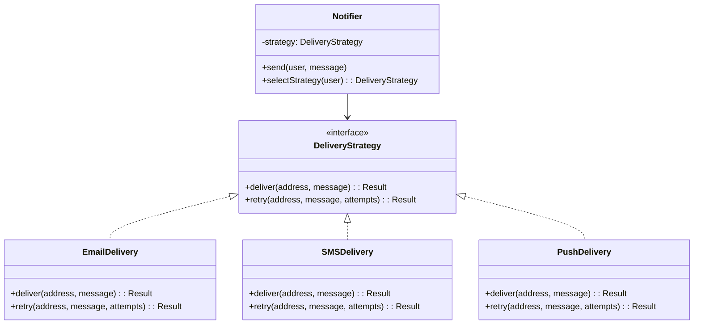

# What Is Clauding?

## Learning Objectives

After reading this chapter, the reader will be able to:

1. Distinguish clauding from coding and explain why they require different skills.
2. Define the two kinds of intent — behavioral and constructional — that must be externalized for agent-based development.
3. Identify which autonomy level (L0–L5) a given development workflow operates at.
4. Determine the bottleneck at each autonomy level and identify what must change to advance to the next level.
5. Describe the layered verification model that replaces manual code review in on-the-loop workflows.

## 1.1 Two Skills, Not One

When a programmer writes code by hand, two activities happen simultaneously: deciding what the code should do and deciding how to construct it. Both kinds of intent — behavioral and structural — remain in the programmer's head and flow directly into the editor. The programmer never separates the two because the same person holds both.

> **Definition: Behavioral intent** — the specification of what the software does: inputs, outputs, edge cases, error handling, and observable behavior.

> **Definition: Constructional intent** — the specification of how the software is built: module boundaries, naming conventions, function size limits, design patterns, and architectural constraints.

Consider a programmer building a notification system. The behavioral intent is: send a notification to a user through their preferred channel — email, SMS, or push notification. Retry on transient failures. Log delivery status. The constructional intent is a separate set of decisions: use the Strategy pattern [@gof1994] so that each delivery channel is an interchangeable implementation behind a common interface. Decompose into a `Notifier` that selects the strategy and a set of `DeliveryStrategy` implementations — one per channel. Keep the selection logic out of the delivery logic.

**Figure 1.1** Strategy pattern for delivery channel selection.

*The `Notifier` delegates delivery to a `DeliveryStrategy` interface. Each channel (email, SMS, push) is an interchangeable implementation. Adding a new channel requires only a new implementation — the selection logic in `Notifier` does not change. This decomposition is a constructional decision: it does not affect what the system does, only how it is built.*

A programmer making these decisions by hand never writes them down separately. The behavioral decisions flow into the method bodies. The constructional decisions — the interface, the decomposition into strategies, the separation of selection from delivery — flow into the class structure and the file layout. Both happen simultaneously, guided by experience and knowledge of design patterns.

When a coding agent writes the code, these two activities split apart. The programmer still decides both what and how. The agent does the typing. If either kind of intent remains unwritten, the agent fills the gap with its own assumptions. Tell the agent "build a notification system that supports email, SMS, and push" without specifying the decomposition, and it will choose its own structure. It may put all three channels in a single function behind a switch statement. It may create an abstract base class where an interface was intended. It may mix selection logic with delivery logic in ways that make adding a fourth channel expensive. These are constructional decisions the agent made because the programmer did not.

This creates a problem that does not exist in manual development. Agents guess confidently. They infer behavioral decisions from partial descriptions. They choose architectural patterns from training data averages. They have no model of what they do not know, and they do not signal when they are guessing.

> **Common Clauding Error:** Leaving constructional intent unspecified. The agent produces code that compiles and passes tests but diverges structurally from the programmer's design. A wrong architectural assumption baked into the first generated function infects everything built on top of it. The assumption is invisible because it was never discussed — the agent made it silently.

> **Definition: Clauding** — the practice of externalizing both behavioral and constructional intent into machine-readable artifacts (requirements, constitutions, architectural constraints), then using coding agents to generate code from those artifacts while verifying the output through automated gates rather than manual review.

A programmer writes code. A clauder writes specifications that code is generated from. The difference is not the tool. The difference is that the specification must now be explicit, because the person who holds the intent is no longer the person who types the code.

## 1.2 Human in the Loop vs. Human on the Loop

The software industry uses several terms for working with coding agents — "vibe coding," "AI-assisted coding," "agentic development" — without distinguishing between fundamentally different modes of operation. The distinction that determines whether agent-based development scales is simpler than any of these terms suggest.

> **Definition: Human in the loop** — a mode of operation where the programmer instructs the agent, reviews every output, and corrects mistakes interactively. The programmer is the verification layer.

> **Definition: Human on the loop** — a mode of operation where the programmer provides specifications and constraints in advance, the agent executes autonomously across many tasks, and the programmer verifies results through automated testing and instrumentation. The programmer builds the verification layer.

The two modes differ in what they require from the programmer:

| | Human in the loop | Human on the loop |
|---|---|---|
| Verification | Manual review of every output | Automated gates (compiler, linter, tests, differential comparison) |
| Intent communication | Conversational, per-task | Formal specifications written in advance |
| Scales to | Small tasks, single files | Thousands of lines across hundreds of tasks |
| Risk | Low — programmer catches errors in real time | Black box — code ships without line-by-line review |

Human-in-the-loop development works when the task scope fits within a single conversation and the programmer can read every generated line. It does not work when the scope exceeds what one person can review. An orchestration pipeline that generates 44,628 lines across 241 tasks over four days produces more code than any programmer can read line by line. At that scale, the programmer must have built verification infrastructure before generation starts — or the output cannot be trusted.

> **From the Field:** Most programmers start in the loop. Open a chat, describe what you want, read what comes back. It feels productive because the code appears fast. It breaks down on anything complex because the agent's guesses diverge from your intent in ways you do not catch until later. The shift to on-the-loop is not about a different tool. It is about writing things down that you used to keep in your head.

## 1.3 Levels of Autonomy

The question of how much a system can handle without human direction needs precise vocabulary. Without it, a team using autocomplete and a team running an autonomous pipeline both describe their workflow as "AI-assisted development." These are not the same thing, and confusing them leads to misdirected investment.

The telecom industry addressed this problem by adapting the SAE autonomy levels for self-driving vehicles into a six-level taxonomy for network automation [@tmforum-ig1218]. The labels are vendor-consortium artifacts with the incentive problems that implies. Used as vocabulary rather than gospel, they map to software development with minor adaptation.

> **Definition: Autonomy level** — a classification of how much of the plan-and-execute cycle a system handles without human direction. Levels range from L0 (fully manual) to L5 (fully self-managing).

**L0 — Manual.** The programmer types every line. The AI serves as a reference — a dictionary, a syntax reminder. No generation occurs.

**L1 — Assisted.** The AI suggests completions within the current line or function. Autocomplete, linters, and CI/CD fall here. The programmer decides everything. The AI proposes; the programmer accepts or rejects.

**L2 — Partial.** The AI implements within a bounded scope — a file, a function, a test. The programmer approves every decision. GitHub Copilot and most IDE integrations operate at this level. The programmer plans the work; the AI executes pieces; the programmer reviews every piece.

**L3 — Conditional.** The AI implements tasks from specifications within a bounded domain. The generation loop is closed: spec in, code out, tests verify. The programmer writes the specification and reviews test results, not individual lines of code. Claude Code with a well-structured project operates here. The cobbler-scaffold pipeline operates here: it reads requirements, decomposes them into tasks, generates code for each task, and verifies output through differential testing.

**L4 — High autonomy.** The AI reads documented intent, proposes its own work breakdown, and implements with minimal human oversight during execution. The distinction from L3: at L3 the programmer decomposes work into tasks. At L4, the system decomposes the work. The programmer writes intent; the system determines what that intent requires.

**L5 — Recursive.** The system manages its own evolution from high-level intent alone. It identifies what needs to change, proposes the change, implements it, and validates it — including changes to its own infrastructure. This is a research frontier.

### 1.3.1 Bottlenecks by Level

Each level has a different bottleneck. The bottleneck determines what a team must change to advance to the next level. Investing in the wrong layer — buying a faster model when the problem is missing specifications — produces no improvement.

| Level | Bottleneck | What must change |
|---|---|---|
| L1–L2 | Execution speed | Better models, faster suggestions, more parallelism |
| L3 | Specification quality | Requirements engineering — externalizing intent into formal specs |
| L4 | Architectural documentation | Constraints in machine-readable form that the system treats as non-negotiable |
| L5 | Verification trust | Frameworks robust enough to validate changes the system proposes to itself |

> **Performance Observation:** Most teams operating at L2 believe their bottleneck is model capability. In practice, the model is capable of L3 work. The specifications required to drive L3 generation do not exist. The team has not written them because, until now, the specifications lived in the programmers' heads.

### 1.3.2 What Changes About the Programmer's Role

The autonomy level determines what kind of human work remains:

| Level | Programmer's role |
|---|---|
| L0–L1 | Write code, guided by suggestions |
| L2 | Review and approve AI output within tasks |
| L3 | Decompose work into tasks, write specifications, verify through automated tests |
| L4 | Write documented intent, review AI-proposed work breakdowns |
| L5 | Set goals; the system handles everything below |

The programmer does not disappear at higher levels. The work moves from writing code to writing specifications (L3), from writing specifications to writing intent (L4), and from writing intent to defining goals (L5). At every level, the programmer's contribution is the thing the system cannot generate for itself.

## 1.4 The Verification Problem

Agent-generated code introduces a verification problem that does not exist at the same scale in manual development. When the programmer writes every line, manual review is the default verification method. When an agent generates thousands of lines across hundreds of tasks, manual review is no longer feasible. The verification method must change.

The verification problem has two parts. First, does the generated code match the specification? Second, does the specification match the programmer's intent? The first part is testable through automated means. The second part is where the hardest defects live — in agent-generated code and in manually written code alike.

### 1.4.1 Layers of Verification

Verification confidence comes from multiple independent layers, each catching a different class of defect:

1. **Compilation.** The code is syntactically and type-correct.
2. **Linting.** The code conforms to structural rules — function length limits, duplication thresholds, complexity bounds.
3. **Unit and integration tests.** Specified behaviors produce expected outputs.
4. **Test coverage.** The tests exercise the meaningful behaviors, not just the easy paths.
5. **Specification conformance.** The behavior matches the spec — verified through differential testing against a reference implementation when one exists.
6. **Intent conformance.** The spec matches what the programmer actually wanted.

Each layer adds confidence. No single layer is sufficient. Layers 1–5 are automatable. Layer 6 is not — it requires the programmer to verify that what was specified is what was meant. This is the layer where specification defects surface.

Verification is not the end of the cycle. When verification finds defects, something must repair them — and repair is a different operation from building, with different context and different success criteria (Chapter 2). Over time, the accumulated code also needs structural review: identifying inconsistencies and duplication that no individual task introduced but that degrade the codebase as a whole. The full development cycle — plan, build, verify, repair, improve — is covered in detail in Part V.

> **Good Clauding Practice:** Treat verification as a stack, not a single check. A pipeline that compiles and passes tests but skips linting ships code with structural defects. A pipeline that lints but does not run differential tests ships code with behavioral defects. Each layer catches what the layers below it miss.

> **From the Field:** Programmers who have deployed ML models in production already know this pattern. Nobody validates a neural network by reading the weights. The validation pipeline — test set performance, A/B testing, drift monitoring, rollback triggers — builds confidence through layers of automated evidence. Clauding applies the same discipline to code generation. The generated code is the model output. The programmer's job is the validation pipeline.

## 1.5 What This Book Teaches

Each part of this book addresses what is required to advance one autonomy level safely.

**Part II: Requirements.** Externalizing intent so agents can work autonomously. Where requirements come from, how to write specifications that agents execute reliably, what goes wrong when specifications are incomplete. This is the skill required to move from L2 to L3.

**Part III: Testing.** Verifying code that was not written by a human and cannot be reviewed line by line. Differential testing, generated test suites, property-based testing. This is the verification infrastructure that makes L3 trustworthy.

**Part IV: How Do You Know Your Code Is Correct?** What "correct" means when the programmer did not write the code. Mechanical verification, code inspection at scale, building confidence through layers of evidence. This is what makes the transition from L3 to L4 safe.

**Part V: Agent Orchestration.** The machinery that makes on-the-loop development work at scale. Multiple agents with different roles, coordination through GitHub issues and state files, failure modes and recovery, orchestration loop design. This is the engineering of L3–L4 systems.

**Part VI: Instrumentation.** Observing what the agents are doing. Logging, cost analysis, failure mode diagnosis, building the intuition that feeds back into better specifications. This is what turns an autonomous pipeline from an experiment into a repeatable process.

## 1.6 The Compounding Advantage

Coding agents generate code — including code that improves the agents themselves. The cobbler-scaffold orchestrator was built with Claude. It generates code using Claude. It was improved using data it generates about its own performance. Each improvement to the pipeline reduces cost and increases output quality on the next run.

The programmer who builds this loop — who writes the specifications, builds the verification infrastructure, instruments the pipeline, and improves the tooling based on what the instrumentation reveals — has a compounding advantage over the programmer who waits for a vendor to ship a product that does it.

The tools will change. The models will change. The APIs will change. The need to specify intent precisely, verify output rigorously, and build infrastructure that earns trust in what ships — that does not change. Those skills compound regardless of which model is behind the cursor.

## Summary

This chapter introduced clauding as the practice of externalizing intent into formal artifacts and verifying agent-generated code through automated layers rather than manual review. The two modes of working with coding agents — human in the loop and human on the loop — differ in whether the programmer is the verification layer or builds it. The six-level autonomy framework (L0–L5) identifies the bottleneck at each level: execution speed at L1–L2, specification quality at L3, architectural documentation at L4, and verification trust at L5. Verification confidence comes from a stack of independent automated layers, each catching a different class of defect. Chapter 2 addresses how to structure the construction process itself — building systems one verified layer at a time rather than generating everything at once. The rest of this book addresses what is required at each autonomy level, in sequence.

## Key Terms

| Term | Definition |
|---|---|
| **Clauding** | The practice of externalizing intent into machine-readable artifacts and verifying agent-generated code through automated gates |
| **Behavioral intent** | Specification of what the software does: inputs, outputs, edge cases, observable behavior |
| **Constructional intent** | Specification of how the software is built: architecture, module boundaries, coding standards |
| **Human in the loop** | Programmer instructs the agent, reviews every output, and corrects interactively |
| **Human on the loop** | Programmer provides specs in advance, agent executes autonomously, verification is automated |
| **Autonomy level** | Classification of how much of the plan-and-execute cycle a system handles without human direction (L0–L5) |
| **Verification stack** | Multiple independent automated layers (compilation, linting, tests, coverage, spec conformance, intent conformance), each catching a different defect class |
